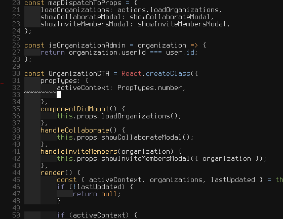

# vim-react-proptypes-snippets
> A set of snippets for Vim to work with Facebook's [React](http://facebook.github.io/react/) PropTypes.



## Installation

Use your preferred Vim plugin installation method.
- [NeoBundle](https://github.com/Shougo/neobundle.vim)
- [Vundle](https://github.com/gmarik/vundle)
- [pathogen](https://github.com/tpope/vim-pathogen)

Example using `NeoBundle`:

```vim
" vim-react-snippets:
NeoBundle "pgilad/vim-react-proptypes-snippets"

" Ultisnips
NeoBundle "SirVer/ultisnips"

" Other sets of snippets (optional):
NeoBundle "honza/vim-snippets"
```

## Usage

Within any Javascript or JSX file, you should be able to do the following:

(in insert mode)
```
ptfr<Tab>
```

Expanding to

```js
PropTypes.func.isRequired,
```

And a bunch of others!
Check [UltiSnips/javascript.snippets](UltiSnips/javascript.snippets) to see the full list.

## License

MIT © [Gilad Peleg](https://www.giladpeleg.com)
